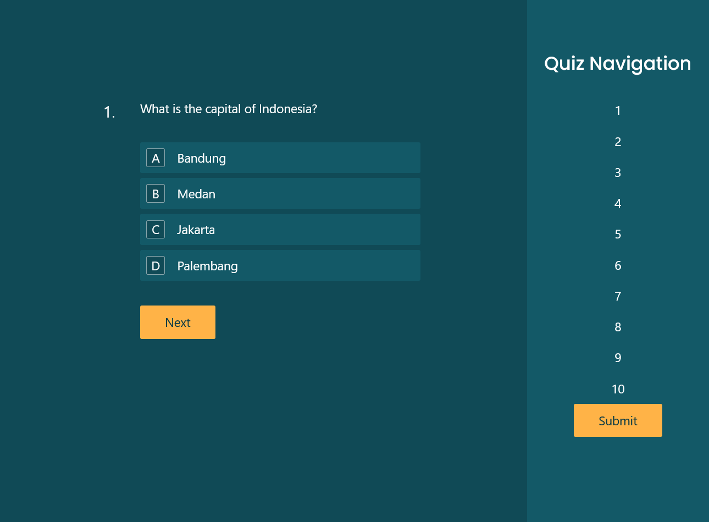

# Progressive Quizzz

## Description

This app allows users to take a multiple-choice quiz on Geography subjects in a personal, beautiful, and convenient environment.

Here is what the app looks like:

## Features

- Sign up, login, and logout with [firebase](https://firebase.google.com/) authentification
- Multiple choice quiz
- Next and previous button, and quiz navigation
- Score calculation
- Responsive display (mobile, tab, and web)
- Server-side rendering

## How To Run

Visit the deployment on [this link](https://quizzz-v1.vercel.app/)

If you want to run this app in local computer, do:

1. Download this repository
2. Run `npm install` or `yarn install` to install all the dependencies of the app
3. Run `npm run dev` or `yarn dev` to execute the app
4. Open [http://localhost:30000](https://localhost:3000) with your browser to see the result

## Technologies

- Server-side rendering by [Next.js](https://nextjs.org/docs)
- [Firebase](https://firebase.google.com/) authentication
- [React.js](https://reactjs.org/) front end framework
- [Redux](https://redux.js.org/) state management
- [Tailwind](https://tailwindcss.com) css library
